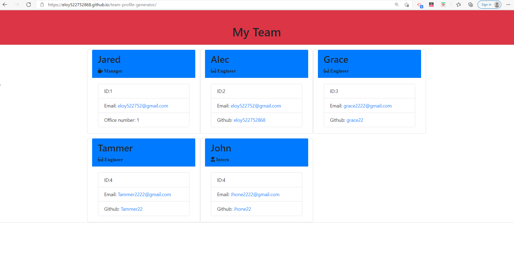

# team-profile-generator

## Description
On this project I was tasked to build a Node.js command-line application that takes in information about employees on a software engineering team, then generates an HTML webpage that displays summaries for each person. Testing is key to making code maintainable, so you’ll also write a unit test for every part of your code and ensure that it passes each test.

## Screenshots of readme generation & readme

### Start prompt input to generate file

### Ask questions regarding  information to Team

### Generated HTML

### Deployed Site Details

Link to readme file below:

[MY Team Site](https://eloy522752868.github.io/team-profile-generator/)

[Video Instructions](https://drive.google.com/file/d/116KAKRpZJs-JfOwjCgB-w6LJ-rqNfw4b/view?usp=sharing/)
